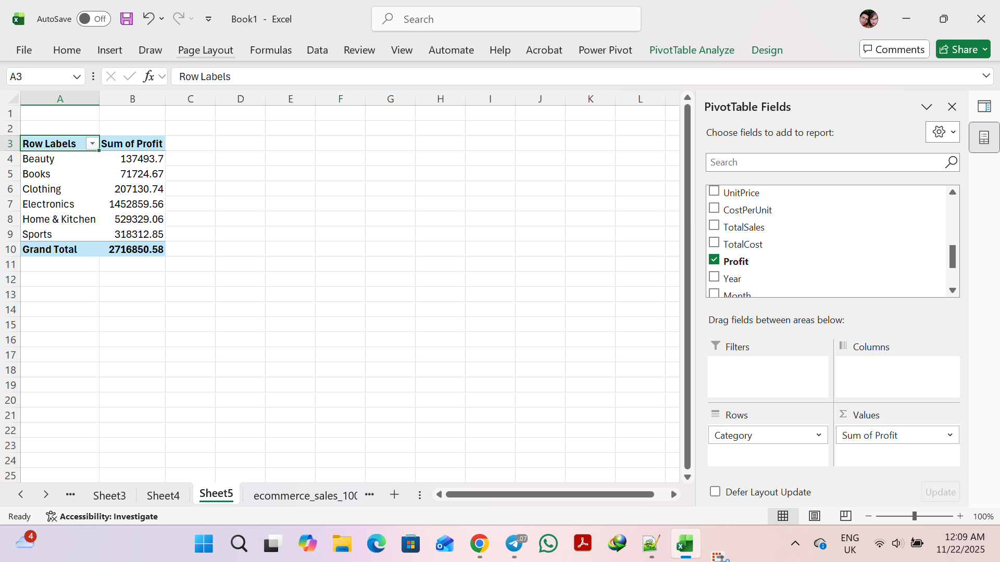
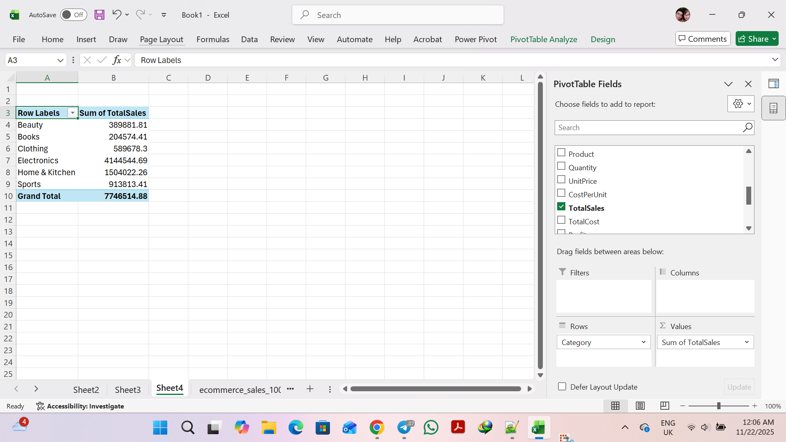
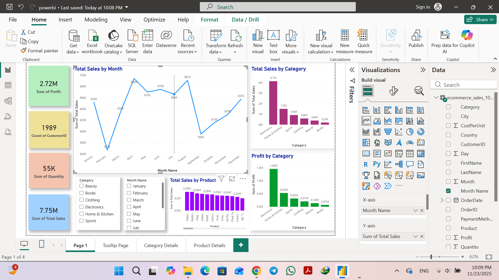
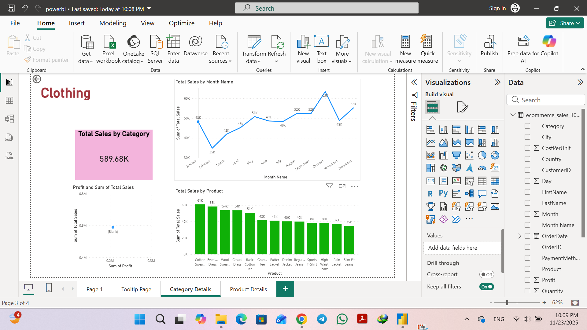
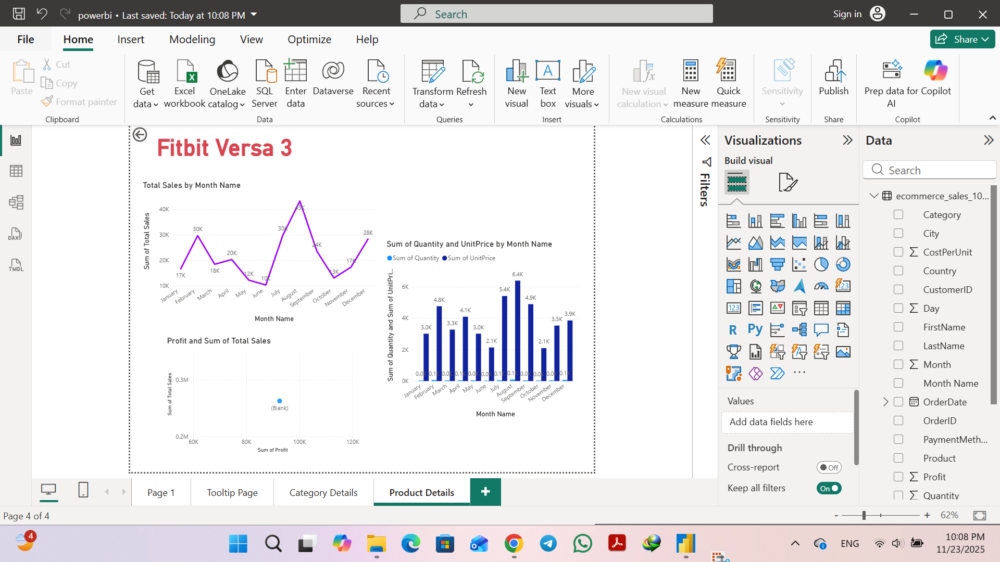

# 📊 E-Commerce Sales Dashboard (Excel + Power BI)

A complete end-to-end data analytics project using **Excel** and **Power BI**, based on a synthetic dataset of **10,000 e-commerce orders**.  
This dashboard demonstrates skills in **Power Query**, **PivotTables**, **DAX**, **Drillthrough**, **Tooltip pages**, and **interactive BI design**.

---

# 🧹 Excel Analysis (PivotTables)

## 1️⃣ Monthly Sales Overview  

---

## 2️⃣ Profit by Category  

---

## 3️⃣ Sales by Category  

---

## 4️⃣ Top 10 Products by Total Sales  

---

# 📊 Power BI Dashboard

## ⭐ Main Dashboard  

---

## ⭐ Drillthrough – Category Details  

---

## ⭐ Drillthrough – Product Details  

---

## ⭐ Custom Tooltip Page  

---

# 🛠 Tools Used
- Excel (Power Query, PivotTables)
- Power BI (DAX, Modeling, Drillthrough, Tooltip)
- GitHub for hosting

---

# 📧 Contact  
Created by **Forough Moosavi**  
📩 Email: **forooghmousavi1371@gmail.com**

If you found this project useful, please ⭐ the repository!
