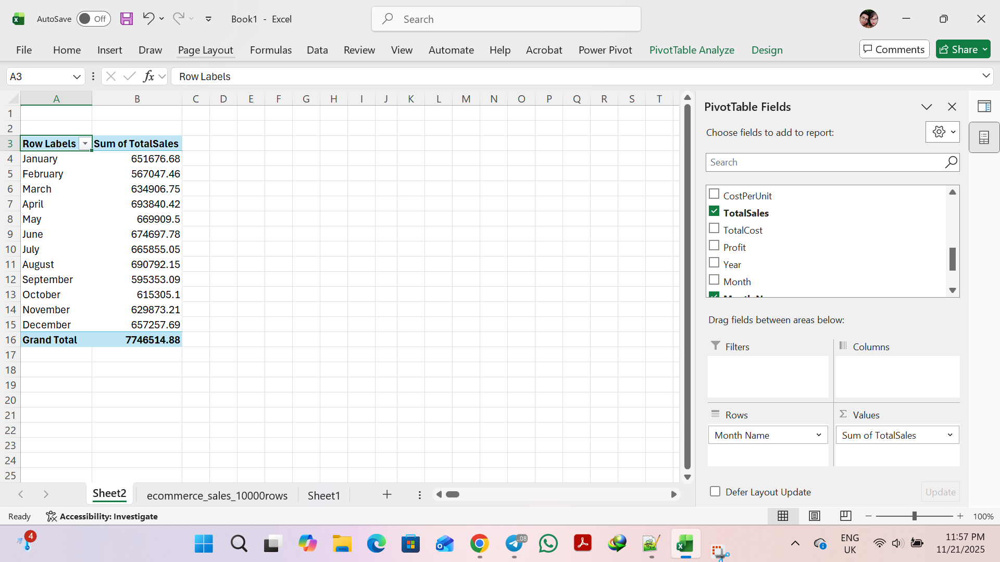
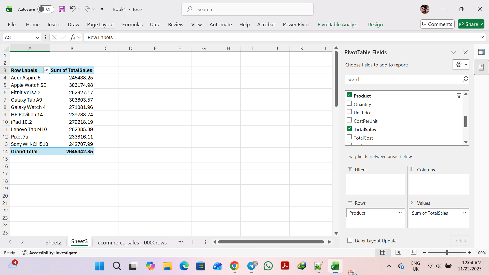
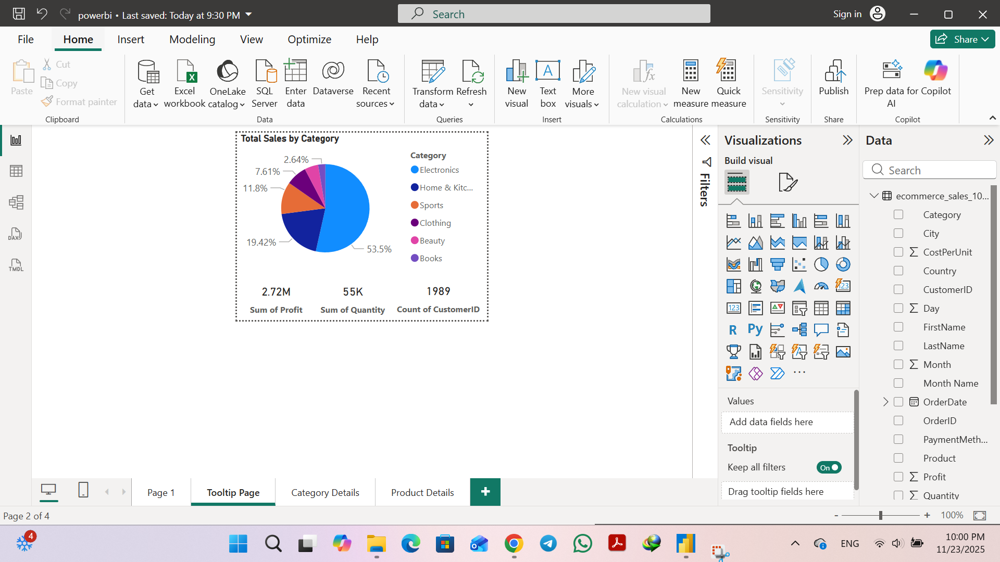

# 📊 E-Commerce Sales Dashboard (Excel + Power BI)

A complete **end-to-end business analytics project** built using **Excel** and **Power BI**, based on a synthetic dataset of **10,000+ e-commerce orders**.

This project demonstrates strong skills in:
- **Power Query**
- **Data Cleaning**
- **PivotTables & Excel Analysis**
- **Data Modeling**
- **DAX Calculations**
- **Interactive Dashboard Design**
- **Drillthrough Pages**
- **Custom Tooltip Reports**

---

# 🧹 1. Excel Analysis (PivotTables)

### ✅ Monthly Sales Overview  


---

### ✅ Profit by Category  


---

### ✅ Total Sales by Category  


---

### ✅ Top 10 Products by Total Sales  


---

# 🚀 2. Power BI Interactive Dashboard

### 📌 Main Dashboard  
Includes:
- Monthly Sales Trend  
- KPI Cards (Sales, Profit, Quantity)  
- Category-wise Sales  
- Profit Analysis  
- Product Ranking  
- Slicers (Category, Month)


---

# 🎯 3. Drillthrough Pages

### 🔍 Category Details Drillthrough  
Dynamic breakdown of:
- Category total sales
- Monthly trend
- Product-level analysis


---

### 🔍 Product Details Drillthrough  
Shows:
- Monthly sales trend for a selected product
- Quantity & UnitPrice comparison
- Profit vs Sales scatter chart


---

# 🪄 4. Tooltip Page (Mini Report)

A custom interactive tooltip appears when hovering over visuals.



---

# 📁 Project Structure

```
ecommerce-sales-dashboard/
│
├── ecommerce_sales_10000rows.csv
├── excel.xlsx
├── powerbi.pbix
└── screenshots/
    ├── excel_Monthly_Sales.png
    ├── excel_Profit_by_Category.png
    ├── excel_Sales_by_Category.png
    ├── excel_Top_10_Products_by_TotalSales.png
    ├── powerbi_main_dashboard.png
    ├── powerbi_drill_category.png
    ├── powerbi_drill_product.png
    └── powerbi_tooltip.png
```

---

# 👩‍💻 Author

**Forough Moosavi**  
Data Analyst | Power BI Developer  

📧 Email: **forooghmousavi1371@gmail.com**  
📧 Secondary: **forough.analytics@outlook.com**

---
⭐ If you found this project useful

Please give the repository a star ⭐ — it helps a lot!
